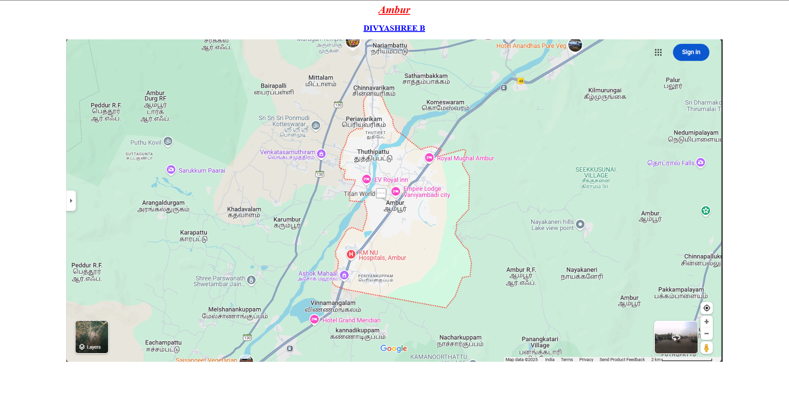
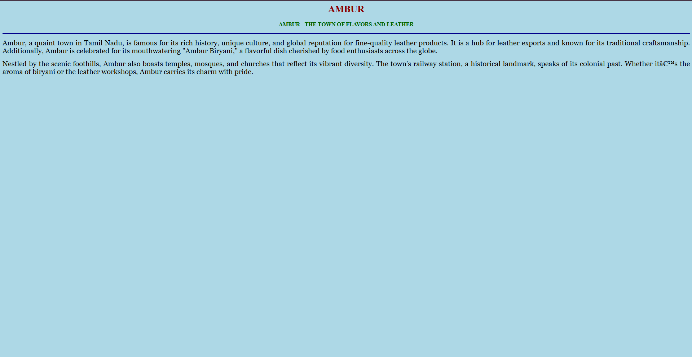
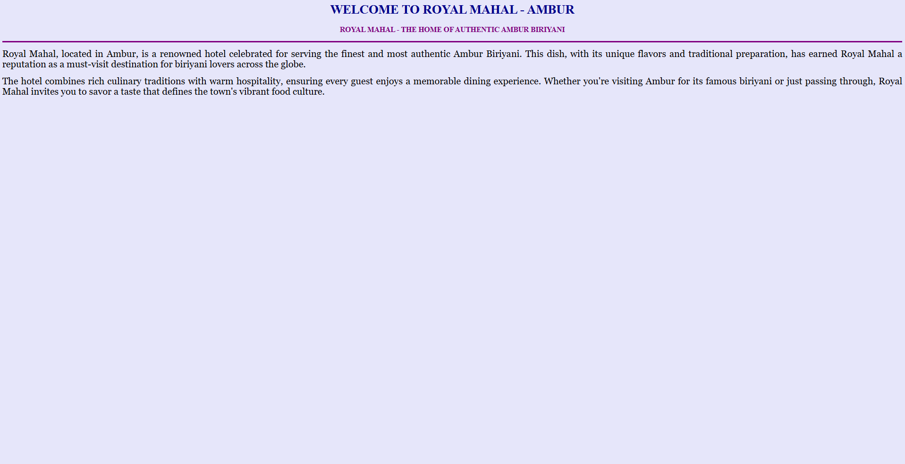
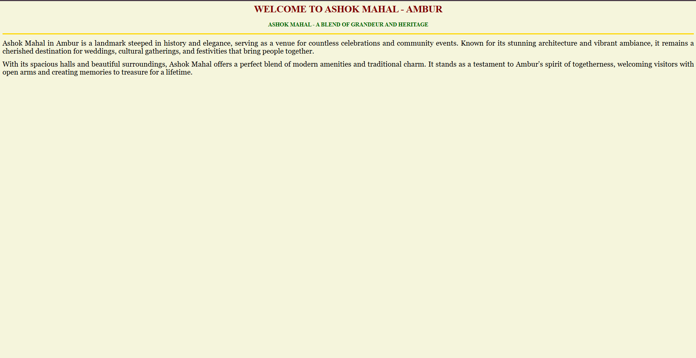
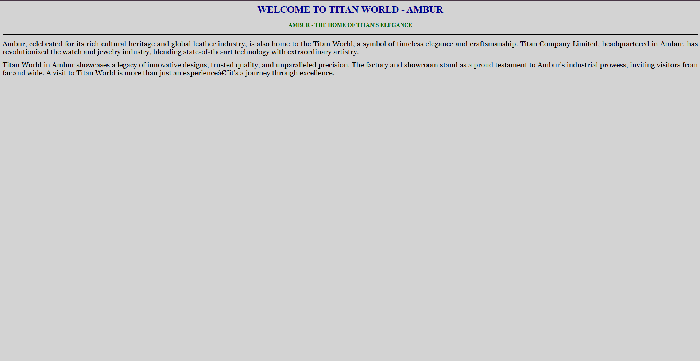
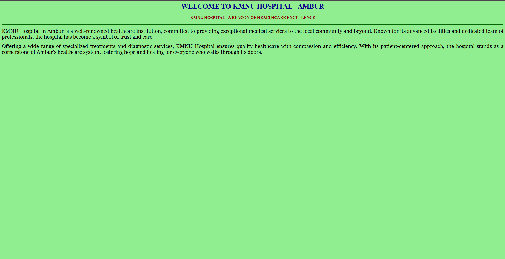

# Ex04 Places Around Me
## Date: 23/04/2025

## AIM
To develop a website to display details about the places around my house.

## DESIGN STEPS

### STEP 1
Create a Django admin interface.

### STEP 2
Download your city map from Google.

### STEP 3
Using ```<map>``` tag name the map.

### STEP 4
Create clickable regions in the image using ```<area>``` tag.

### STEP 5
Write HTML programs for all the regions identified.

### STEP 6
Execute the programs and publish them.

## CODE

```
map.html
<html>
  <body>
    <h1 align="center">
      <font color="red"><i><u>Ambur</u></i></font>
    </h1>
    <h2 align="center">
      <font color="blue"><u>DIVYASHREE B</u></font>
    </h2>
    <center>
    
    <map name="image-map">
    <area target="" alt="Ambur" title="Ambur" href="home.html" coords="891,541,1053,436" shape="rect">
    <area target="" alt="KMNU hospital" title="KMNU hospital" href="kmnu.html" coords="816,585,1015,663" shape="rect">
    <area target="" alt="Royal Mughal Ambur" title="Royal Mughal Ambur" href="hotel.html" coords="1155,343,97" shape="circle">
    <area target="" alt="Ashok Mahaal" title="Ashok Mahaal" href="ashok.html" coords="740,690,78" shape="circle">
    <area target="" alt="Titan World" title="Titan World" href="titan.html" coords="804,421,917,495" shape="rect">
</map>
    </center>
  </body>
</html>

home.html
<html>
<head>
    <title>MY HOMETOWN</title>
</head>
<body bgcolor="lightblue">
    <h1 align="center">
        <font color="darkred"><b>AMBUR</b></font>
    </h1>
    <h3 align="center">
        <font color="darkgreen"><b>AMBUR - THE TOWN OF FLAVORS AND LEATHER</b></font>
    </h3>
    <hr size="3" color="darkblue">
    <p align="justify">
        <font face="Georgia" size="5">
            Ambur, a quaint town in Tamil Nadu, is famous for its rich history, unique culture, and global reputation for fine-quality leather products. It is a hub for leather exports and known for its traditional craftsmanship. Additionally, Ambur is celebrated for its mouthwatering "Ambur Biryani," a flavorful dish cherished by food enthusiasts across the globe. 
        </font>
    </p>
    <p align="justify">
        <font face="Georgia" size="5">
            Nestled by the scenic foothills, Ambur also boasts temples, mosques, and churches that reflect its vibrant diversity. The town's railway station, a historical landmark, speaks of its colonial past. Whether it’s the aroma of biryani or the leather workshops, Ambur carries its charm with pride.
        </font>
    </p>
</body>
</html>

titan.html
<html>
<head>
    <title>AMBUR - TITAN WORLD</title>
</head>
<body bgcolor="lightgray">
    <h1 align="center">
        <font color="darkblue"><b>WELCOME TO TITAN WORLD - AMBUR</b></font>
    </h1>
    <h3 align="center">
        <font color="darkgreen"><b>AMBUR - THE HOME OF TITAN'S ELEGANCE</b></font>
    </h3>
    <hr size="3" color="black">
    <p align="justify">
        <font face="Georgia" size="5">
            Ambur, celebrated for its rich cultural heritage and global leather industry, is also home to the Titan World, a symbol of timeless elegance and craftsmanship. Titan Company Limited, headquartered in Ambur, has revolutionized the watch and jewelry industry, blending state-of-the-art technology with extraordinary artistry.
        </font>
    </p>
    <p align="justify">
        <font face="Georgia" size="5">
            Titan World in Ambur showcases a legacy of innovative designs, trusted quality, and unparalleled precision. The factory and showroom stand as a proud testament to Ambur's industrial prowess, inviting visitors from far and wide. A visit to Titan World is more than just an experience—it's a journey through excellence.
        </font>
    </p>
</body>
</html>

ashok.html
<html>
<head>
    <title>ASHOK MAHAL - AMBUR</title>
</head>
<body bgcolor="beige">
    <h1 align="center">
        <font color="maroon"><b>WELCOME TO ASHOK MAHAL - AMBUR</b></font>
    </h1>
    <h3 align="center">
        <font color="darkgreen"><b>ASHOK MAHAL - A BLEND OF GRANDEUR AND HERITAGE</b></font>
    </h3>
    <hr size="3" color="gold">
    <p align="justify">
        <font face="Georgia" size="5">
            Ashok Mahal in Ambur is a landmark steeped in history and elegance, serving as a venue for countless celebrations and community events. Known for its stunning architecture and vibrant ambiance, it remains a cherished destination for weddings, cultural gatherings, and festivities that bring people together.
        </font>
    </p>
    <p align="justify">
        <font face="Georgia" size="5">
            With its spacious halls and beautiful surroundings, Ashok Mahal offers a perfect blend of modern amenities and traditional charm. It stands as a testament to Ambur's spirit of togetherness, welcoming visitors with open arms and creating memories to treasure for a lifetime.
        </font>
    </p>
</body>
</html>

hotel.html
<html>
<head>
    <title>ROYAL MAHAL - AMBUR</title>
</head>
<body bgcolor="lavender">
    <h1 align="center">
        <font color="darkblue"><b>WELCOME TO ROYAL MAHAL - AMBUR</b></font>
    </h1>
    <h3 align="center">
        <font color="purple"><b>ROYAL MAHAL - THE HOME OF AUTHENTIC AMBUR BIRIYANI</b></font>
    </h3>
    <hr size="3" color="purple">
    <p align="justify">
        <font face="Georgia" size="5">
            Royal Mahal, located in Ambur, is a renowned hotel celebrated for serving the finest and most authentic Ambur Biriyani. This dish, with its unique flavors and traditional preparation, has earned Royal Mahal a reputation as a must-visit destination for biriyani lovers across the globe.
        </font>
    </p>
    <p align="justify">
        <font face="Georgia" size="5">
            The hotel combines rich culinary traditions with warm hospitality, ensuring every guest enjoys a memorable dining experience. Whether you're visiting Ambur for its famous biriyani or just passing through, Royal Mahal invites you to savor a taste that defines the town's vibrant food culture.
        </font>
    </p>
</body>
</html>

kmnu.html
<html>
<head>
    <title>KMNU HOSPITAL - AMBUR</title>
</head>
<body bgcolor="lightgreen">
    <h1 align="center">
        <font color="darkblue"><b>WELCOME TO KMNU HOSPITAL - AMBUR</b></font>
    </h1>
    <h3 align="center">
        <font color="darkred"><b>KMNU HOSPITAL - A BEACON OF HEALTHCARE EXCELLENCE</b></font>
    </h3>
    <hr size="3" color="darkgreen">
    <p align="justify">
        <font face="Georgia" size="5">
            KMNU Hospital in Ambur is a well-renowned healthcare institution, committed to providing exceptional medical services to the local community and beyond. Known for its advanced facilities and dedicated team of professionals, the hospital has become a symbol of trust and care.
        </font>
    </p>
    <p align="justify">
        <font face="Georgia" size="5">
            Offering a wide range of specialized treatments and diagnostic services, KMNU Hospital ensures quality healthcare with compassion and efficiency. With its patient-centered approach, the hospital stands as a cornerstone of Ambur's healthcare system, fostering hope and healing for everyone who walks through its doors.
        </font>
    </p>
</body>
</html>
```


## OUTPUT













## RESULT


The program for implementing image maps using HTML is executed successfully.
